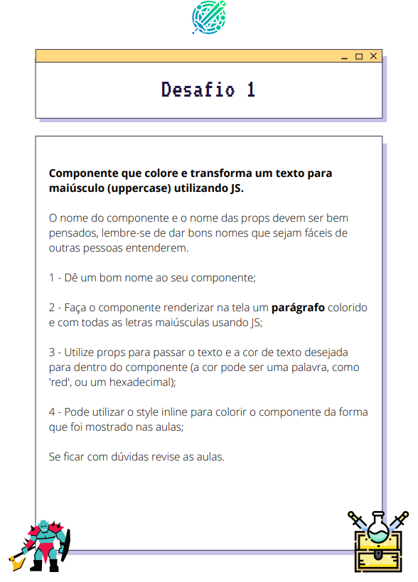
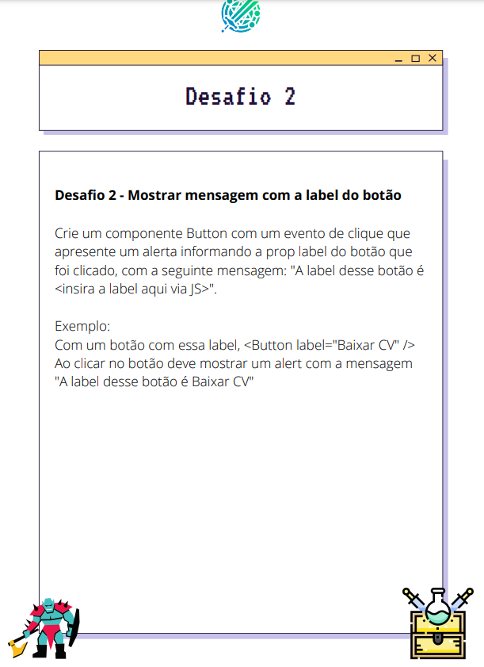
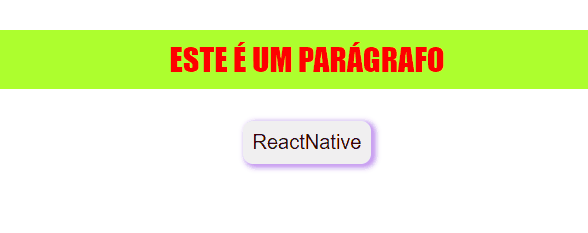

# Quest - Base do React (DEVQUEST)

Resolução da Quest do DevEmDobro - A BASE DO REACT

Este projeto é um exercício de fixação do curso DEVQUEST sobre a base do React, onde busco resolver as quests
aplicando o que foi aprendido sobre "Props" e "Eventos" no React.

Obs.: Tenho ciência de que a extensão mais utilizada atualmente é a VITE, porém eu me desafiei
a resolver essa quest utilizando o React App.

Confira as Quests abaixo:

[]
[]

Resolução:

[]

## Tecnologias utilizadas:

- REACT
- CSS
- JavaSript
